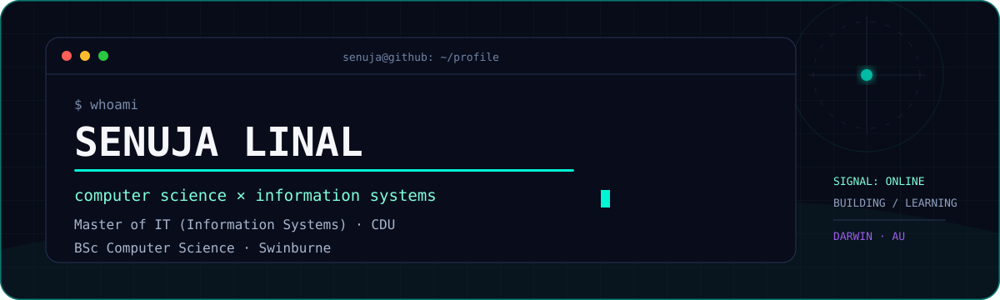
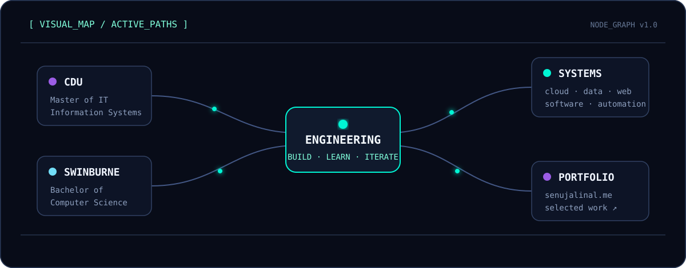
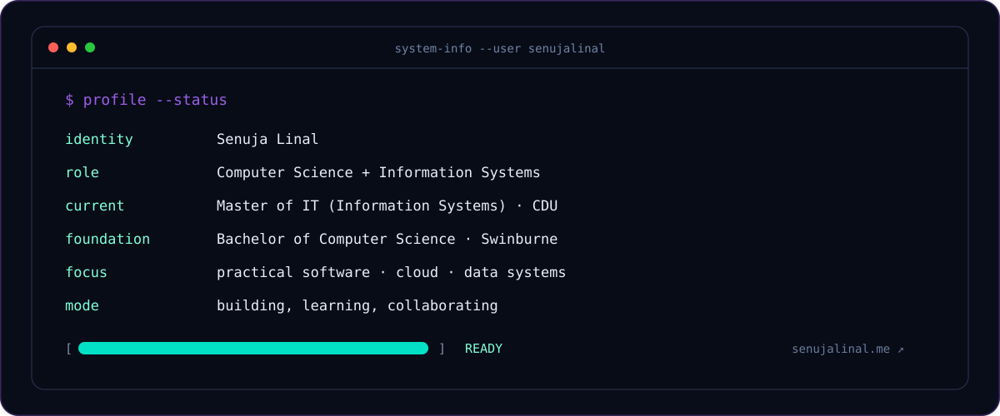

<div align="center">
  <a href="https://senujalinal.me">
    
  </a>
</div>

<br/>

<div align="center">
  <a href="https://senujalinal.me"></a>
  <a href="https://github.com/senujalinal"></a>
  <a href="https://www.linkedin.com/in/senujalinal"></a>
</div>

## ` Visual_Map`

<a href="https://senujalinal.me">
  
</a>

## `System_Info`



## ` // technology_matrix`

<div align="center">

**Languages**


**Web & Application**


**Data & Systems**


**Cloud**


</div>

## ` Portfolio_and_contact`

```text
> open ./portfolio
  Selected work, experiments, and the things I am building:
  https://senujalinal.me

> connect --channel
  GitHub   : https://github.com/senujalinal
  LinkedIn : https://www.linkedin.com/in/senujalinal
```

<div align="center">
  <a href="https://senujalinal.me">
    
  </a>
</div>


## ` // Contribution_signal`

<div align="center">
  
</div>

---

<div align="center">
  <sub><code>STATUS: ONLINE</code> · learning continuously · building thoughtfully</sub>
</div>
